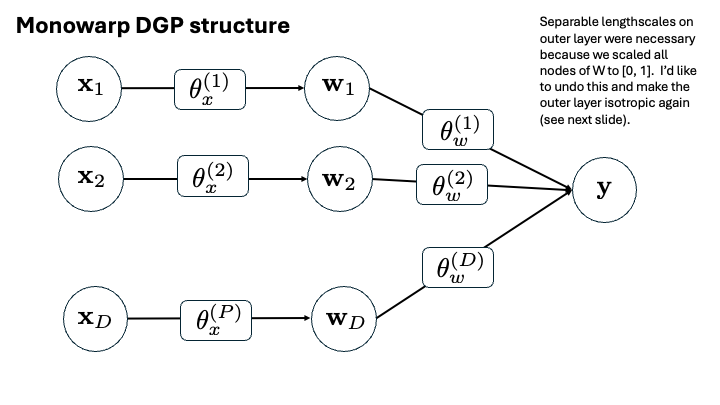
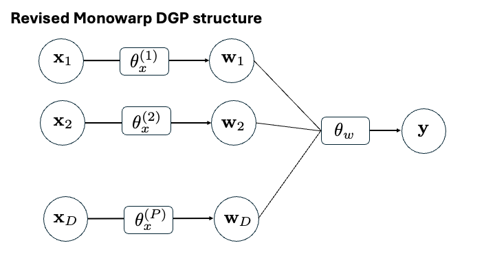

```{r setup, include=FALSE}
knitr::opts_chunk$set(echo = TRUE, fig.align = "center")
```

### Abstract

In the first quarter of Year 1, PI Annie Booth (Virginia Tech) worked collaboratively with Kevin Quinlan and Laura Wendelberger (LLNL) to develop methodology for deep Gaussian surrogates with large input dimensions.  Our general aims are two-fold: develop methodology for variable selection and dimension reduction through latent manifolds.  This quarter the team focused on the variable selection problem, proposing a novel Bayesian hierarchical model for the deep Gaussian process prior that will facilitate variable selection.  Methods were explored and validated on toy problems, and software was developed to integrate and implement new methodologies.  Results are promising, achieving strong performance on toy problems with adequate training data, but more work is needed to address limited data scenarios.

### Summary of Objectives

Objective 1: Provide research plans to LLNL and suggestions for each quarters activities to be approved by LLNS.

* PI Booth worked with the LLNL team to restructure the year 1 budget to support her direct efforts on the project this quarter in leui of a graduate student.  In the second quarter, PI Booth will continue her efforts in searching for a graduate student from the Department of Statistics at Virginia Tech to work on this project.  PI Booth's focus for quarters 1-2 will be on variable selection.  The future GRA's focus starting in quarter 3 will be on dimension reduction.

Objective 2: Perform methodological development of Bayesian DGP emulator models for variable selection and learning of lower dimensional manifolds.

* Technical details of methodological and software developments are provided in the remainder of this document.

### Publications

There are no publications of this work yet.

******

# Technical Details

```{r}
library(deepgp)
library(mvtnorm)
library(lhs)
library(invgamma)
```

# Previous works

Variable selecton with DGPs has not yet been entertained, but variable selection for GPs is a rather common problem.  Most works on variable selection with GPs use a linear mean and a separable covariance with the lengthscale in the numerator.  

$$
\mathbf{y} \sim \mathcal{N}\left(X\beta, \Sigma_x\right)
\quad\textrm{where}\quad
\begin{array}{rl}
(X\beta)^{(i)} &= \sum_{d=1}^D x_{id}\beta_d \\
\Sigma_x^{(ij)} &= \tau^2\left[\mathrm{exp}\left(-\sum_{d=1}^D \theta_d(x_{id} - x_{jd})^2\right) + g\mathbb{I}_{i=j}\right]
\end{array}
$$

There is a closed-form MLE available for $\hat{\beta}$ and $\hat{\tau}^2$:

$$
\hat{\beta} = (X^\top \Sigma_x^{-1}X)^{-1} X^\top\Sigma_x^{-1} \mathbf{y}
$$

$$
\hat{\tau}^2 = \frac{1}{n}(\mathbf{y} - X\hat{\beta})^\top \Sigma_x^{-1}(\mathbf{y} - X\hat{\beta})
$$

The lengthscales $\boldsymbol\theta = [\theta_1, ..., \theta_d]$ require numerical optimization.

In this framework, there are two avenues for "de-selecting" an input.

1. A particular $x_d$ could be taken out of the mean term $X\beta$.  This is equivalent to $\beta_d = 0$.
2. A particular $x_d$ could be taken out of the covariance term $\Sigma_n$.  This is equivalent to $\theta_d = 0$.

### Important Citations

* @linkletter2006variable: Places a mixture model prior on the lengthscale parameters with a point mass on zero.  This method is called "reference distribution variable selection."
* @joseph2008blind: Perform variable selection only in the $X\beta$ mean term.  This method is called "blind kriging."
* @zhang2023indicator: Uses indicator functions to turn variables on/off.  If the indicator is zero, then the $\beta_i$ parameter in the $X\beta$ mean AND the $\theta_i$ parameter in the separable covariance are zero.  Note, to set $\theta$ equal to zero, we must put it in the numerator of the kernel.  This is considered the "state-of-the-art" at this time.

### Software Implementation

Blind kriging is implemented in the `ooDACE` toolbox for MATLAB.  I have successfully installed this software and tested it on toy problems.  I need to figure out an automated way to "grab" the inputs that are retained in the mean term (as of now, the software prints the regex equation to the console).

I contacted the authors of @zhang2023indicator, and they sent me the MATLAB code to implement their method.  I have successfully tested it on toy problems.

Both of these competitors are ready to be deployed on benchmark problems against our proposed novel method.

# Traditional DGPs

In our typical DGP framework [@sauer2023active], we have

$$
\begin{array}{rl}
\mathbf{y}&\sim\mathrm{GP}\left(0,\; \tau^2 (K_{\theta_w}(W) + g\mathbb{I})\right) \\
\mathbf{w}_p &\sim\mathrm{GP}\left(0,\; K_{\theta_x^p}(X) \right) \\
&\quad p=1,\dots,P
\end{array}
\quad\textrm{where}\quad
\begin{array}{rl}
K_{\theta_w}(W)^{(ij)} &= \mathrm{exp}\left(-\frac{1}{\theta_w} \sum_{p=1}^P(w_{ip} - w_{jp})^2\right) \\
K_{\theta_x^p}(X)^{(ij)} &= \mathrm{exp}\left(-\frac{1}{\theta_x^p} \sum_{d=1}^D(x_{id} - x_{jd})^2\right)
\end{array}
$$

The following diagram summarizes the lengthscale structure.  On the latent layers, $\tau^2$ is fixed at 1 and $g$ is fixed at zero.


In the `deepgp` package, this model may be fit with the following code:

```{r, eval = FALSE}
fit <- fit_two_layer(x, y, nmcmc = 10000)
fit <- trim(fit, 5000, 5)
fit <- predict(fit, xp)
```

In this original formulation, all dimensions of $X$ go to all dimensions of $W$.  There is no clear way to "de-select" a dimension of $X$.  If we wanted to draw inspiration from @linkletter2006variable, we could turn  $\theta_x^p$ into separable lengthscales, and then turn some of them off (going to $\infty$ in the denominator is equivalent to 0 in the numerator).  I think this is a terrible idea in our setting, because we would have $D\times P$ many unique lengthscale parameters to estimate here.  Very messy for very little gain.  [Or perhaps we give each dimension of $X$ a unique lengthscale, but keep these the same for all nodes of $W$?.  This just seems counterintuitive to me.]

# Monowarped DGPs

Instead, I propose we embrace one-dimensional warpings, as I have proposed in previous work [@barnett2025monotonic].  Originally, we used the following monowarp DGP structure:

$$
\begin{array}{rl}
\mathbf{y}&\sim\mathrm{GP}\left(0,\; \tau^2 (K_{\theta_w^d}(W) + g\mathbb{I})\right) \\
\mathbf{w}_d &\sim\mathrm{monoGP}\left(0,\; K_{\theta_x^d}(\mathbf{x}_d) \right) \quad d=1,\dots,D
\end{array}
$$
where kernels $K(\cdot)$ are defined as above, and each $\mathbf{w}_d$ is forced to be monotonic.  To get this "monoGP" we used a cumulative sum transformation of random draws from the GP prior.  It is also possible to have each $\mathbf{w}_d$ with a prior mean of $\mathbf{x}_d$ instead of 0.


This monowarped DGP may be fit by providing the argument `monowarp = TRUE` to the `fit_two_layer` function:

```{r, eval = FALSE}
fit <- fit_two_layer(x, y, nmcmc = 10000, monowarp = TRUE)
```

To streamline things, I have developed a work-around to avoid separable lengthscales on the outer layer (by removing forced scaling of each warping).  We can then have the simpler model:

$$
\begin{array}{rl}
\mathbf{y}&\sim\mathrm{GP}\left(0,\; \tau^2 (K_{\theta_w}(W) + g\mathbb{I})\right) \\
\mathbf{w}_d &\sim\mathrm{monoGP}\left(0,\; K_{\theta_x^d}(\mathbf{x}_d) \right) \quad d=1,\dots,D
\end{array}
$$

With fewer parameters to estimate, Bayesian inference will be easier.  This version is now the one implemented in the `deepgp` package (although this update is not on CRAN yet).



# Swapping $\tau^2$ and $\theta$ - what happens in a regular GP?

Notice, in the latent layer of the monowarp DGP, we have fixed $\tau^2 = 1$ and allowed estimation of $\theta$.  Now we propose a SWAP.  Fix $\theta_x^d$ for all $d=1,\dots,D$, but incorporate a $\tau^2_{w_d}$ parameter that may be estimated.  This $\tau^2_{w_d}$ parameter will facilitate variable selection as small values indicate little deviation from the prior (i.e., $\mathbf{w}_d = 0$ for small $\tau^2_{w_d}$).  In this section, we will investigate this idea and how it affects the prior distribution of the warpings.  We are hoping to get a good "proof of concept."

For ease of notation, presume we fix $\theta_x = 1$, although we will later investigate appropriate values for this fixed parameter.  Our monowarp DGP model is then:

$$
\begin{array}{rl}
\mathbf{y}&\sim\mathrm{GP}\left(0,\; \tau_w^2 (K_{\theta_w}(W) + g\mathbb{I})\right) \\
\mathbf{w}_d &\sim\mathrm{monoGP}\left(0,\; \tau_{x_d}^2 K(\mathbf{x}_d) \right) \quad d=1,\dots,D
\end{array}
$$

Why is this so neat?  First, I have read [@zhang2004inconsistent] that in a one-dimensional (or isotropic) setting, only the ratio $\frac{\tau^2}{\theta}$ is identifiable.  The likelihood surface for these two variables is not conducive to optimizing.  Hence our original decision for only estimating the lengthscale.  But we should be able to implement this "swap" and get similar behavior.

### Let's investigate

To see this in action, let's create some random one-dimensional GP data and visualize the likelihood as a function of $\tau^2$ and $\theta$.

```{r, fig.width = 10, fig.height = 5}
x <- seq(0, 1, length = 10)
dx <- sq_dist(x)
y <- drop(rmvnorm(1, sigma = 1*exp(-dx/0.1)))
y <- (y - mean(y))/sd(y) # scale to zero mean unit variance

theta <- round(exp(seq(log(0.01), log(1), length = 50)), 3)
tau2 <- round(seq(0.01, 10, length = 50), 3)
logl <- matrix(nrow = length(theta), ncol = length(tau2))
for (i in 1:length(theta))
  for (j in 1:length(tau2))
    logl[i, j] <- deepgp:::logl(y, dx, tau2 = tau2[j], theta = theta[i], 
                                g = 1e-6, v = 2.5)$ll

par(mfrow = c(1, 2))
plot(x, y, main = "Toy data")
image(theta, tau2, logl, col = heat.colors(128), main = "GP logl")
contour(theta, tau2, logl, add = TRUE)
```

This likelihood surface is not conducive to numerical optimization.  There is a ridge inside the zero contour, and most of the surface is flat.  This corroborates the claim that only the ratio is identifiable.

BUT, if we fix a value of $\tau^2$ as we did originally in the latent layers of the DGP, we can perform effective MLE on $\theta$.  The following code finds the maximum likelihood for three different fixed values of $\tau^2$ given the same toy data.

```{r, fig.width = 10, fig.height = 4.5}
theta <- round(exp(seq(log(0.01), log(1), length = 50)), 3)
tau2 <- c(0.1, 1, 10)
logl <- matrix(nrow = length(theta), ncol = length(tau2))
for (i in 1:length(theta))
  for (j in 1:length(tau2))
      logl[i, j] <- deepgp:::logl(y, dx, tau2 = tau2[j], theta = theta[i], 
                                g = 1e-6, v = 2.5)$ll

par(mfrow = c(1, 3))
for (j in 1:length(tau2)) {
  plot(theta, logl[, j], type = "l", main = paste0("tau2 = ", tau2[j]))
  points(theta[which.max(logl[, j])], max(logl[, j]), pch = 17, col = 4, cex = 2)
}

theta_for_tau2_1 <- theta[which.max(logl[, 2])] # save for later
```

We get different vales for the MLE of $\theta$, but these problems are all identifiable.

Can we do the same thing swapped?  Fix $\theta$ and estimate $\tau^2$?  This is the core of our novel idea.  The following code now shows the maximum likelihood for three different fixed values of $\theta$ given the same toy data.

```{r, fig.width = 10}
theta <- c(0.01, 0.1, 1)
tau2 <- round(seq(0.1, 10, length = 50), 3)
logl <- matrix(nrow = length(theta), ncol = length(tau2))
for (i in 1:length(theta))
  for (j in 1:length(tau2))
      logl[i, j] <- deepgp:::logl(y, dx, tau2 = tau2[j], theta = theta[i], 
                                g = 1e-6, v = 2.5)$ll

par(mfrow = c(1, 3))
for (i in 1:length(theta)) {
  plot(tau2, logl[i, ], type = "l", main = paste0("theta = ", theta[i]))
  points(tau2[which.max(logl[i, ])], max(logl[i, ]), pch = 17, col = 4, cex = 2)
}

tau2_for_theta_0.01 <- tau2[which.max(logl[, 1])] # save for later
```

For full context, how would these different parameter values affect our statistical inferences?  Let's compare predictive surfaces.

```{r, fig.width = 10}
x_new <- seq(0, 1, length = 100)
dx_new <- sq_dist(x_new)
dx_cross <- sq_dist(x_new, x)

# First for fixed tau2 = 1
p1 <- deepgp:::krig(y, dx, dx_new = dx_new, dx_cross = dx_cross, tau2 = 1, 
                   theta = theta_for_tau2_1, g = 1e-6, v = 2.5, mean = TRUE, s2 = TRUE)

# Second, for fixed theta = 0.1
p2 <- deepgp:::krig(y, dx, dx_new = dx_new, dx_cross = dx_cross, tau2 = tau2_for_theta_0.01, 
                   theta = 0.1, g = 1e-6, v = 2.5, mean = TRUE, s2 = TRUE)

par(mfrow = c(1, 2))
plot(x_new, p1$mean, type = "l", main = paste0("tau2 = 1, theta = ", theta_for_tau2_1))
lines(x_new, p1$mean - 2*sqrt(p1$s2), lty = 2)
lines(x_new, p1$mean + 2*sqrt(p1$s2), lty = 2)
points(x, y, col = 2)
plot(x_new, p2$mean, type = "l", main = paste0("tau2 = ", tau2_for_theta_0.01, ", theta = 0.1"))
lines(x_new, p2$mean - 2*sqrt(p2$s2), lty = 2)
lines(x_new, p2$mean + 2*sqrt(p2$s2), lty = 2)
points(x, y, pch = 20, col = 2)
```

Posterior mean is essentially the same, but the larger $\tau^2$ value results in wider UQ intervals.  

There are some interesting things we can learn from this entire exercise.  Some relevant points:

* If we fix $\tau^2$ at a value that is too small, then the MLE for $\theta$ will trend towards zero.  This is a numerical nightmare, and something we wish to avoid.  Typically, we pre-scale $y$ to unit variance anytime we fix $\tau^2=1$, so there is some justification for this choice. 
* If we fix $\theta$ at a value that is too big, then the MLE for $\tau^2$ will tend towards $\infty$, which is also a nightmare.  Could we devise an objective way to determine a good fixed $\theta$ value?
* Likelihood based inference for either of these parameters will only be effective if the fixed parameter is set at a reasonable value.

I suspect that this phenomenon is closely related to the amount of training data present.  Likelihoods are naturally more peaky when there is a lot of data and more flat when there is little data.  To investigate, let's repeat this entire exercise but double the amount of training data.  (Code is suppressed since it is repeated from above).

```{r, echo = FALSE, fig.width = 10, fig.height = 4.5}
x <- seq(0, 1, length = 20)
dx <- sq_dist(x)
y <- drop(rmvnorm(1, sigma = 1*exp(-dx/0.1)))
y <- (y - mean(y))/sd(y) # scale to zero mean unit variance

theta <- round(exp(seq(log(0.01), log(1), length = 50)), 3)
tau2 <- round(seq(0.01, 10, length = 50), 3)
logl <- matrix(nrow = length(theta), ncol = length(tau2))
for (i in 1:length(theta))
  for (j in 1:length(tau2))
    logl[i, j] <- deepgp:::logl(y, dx, tau2 = tau2[j], theta = theta[i], 
                                g = 1e-6, v = 2.5)$ll

par(mfrow = c(1, 2))
plot(x, y, main = "Toy data")
image(theta, tau2, logl, col = heat.colors(128), main = "GP logl")
contour(theta, tau2, logl, add = TRUE)

theta <- round(exp(seq(log(0.01), log(1), length = 50)), 3)
tau2 <- c(0.1, 1, 10)
logl <- matrix(nrow = length(theta), ncol = length(tau2))
for (i in 1:length(theta))
  for (j in 1:length(tau2))
      logl[i, j] <- deepgp:::logl(y, dx, tau2 = tau2[j], theta = theta[i], 
                                g = 1e-6, v = 2.5)$ll

par(mfrow = c(1, 3))
for (j in 1:length(tau2)) {
  plot(theta, logl[, j], type = "l", main = paste0("tau2 = ", tau2[j]))
  points(theta[which.max(logl[, j])], max(logl[, j]), pch = 17, col = 4, cex = 2)
}

theta <- c(0.01, 0.1, 1)
tau2 <- round(seq(0.1, 10, length = 50), 3)
logl <- matrix(nrow = length(theta), ncol = length(tau2))
for (i in 1:length(theta))
  for (j in 1:length(tau2))
      logl[i, j] <- deepgp:::logl(y, dx, tau2 = tau2[j], theta = theta[i], 
                                g = 1e-6, v = 2.5)$ll

par(mfrow = c(1, 3))
for (i in 1:length(theta)) {
  plot(tau2, logl[i, ], type = "l", main = paste0("theta = ", theta[i]))
  points(tau2[which.max(logl[i, ])], max(logl[i, ]), pch = 17, col = 4, cex = 2)
}
```

With more data, we have a bit more wiggle room in parameter values before we encounter bad likelihoods.

What about with less data?  Let's try with half of the original training data.  (Code again suppressed).

```{r, echo = FALSE, fig.width = 10, fig.height = 4.5}
x <- seq(0, 1, length = 5)
dx <- sq_dist(x)
y <- drop(rmvnorm(1, sigma = 1*exp(-dx/0.1)))
y <- (y - mean(y))/sd(y) # scale to zero mean unit variance

theta <- round(exp(seq(log(0.01), log(1), length = 50)), 3)
tau2 <- round(seq(0.01, 10, length = 50), 3)
logl <- matrix(nrow = length(theta), ncol = length(tau2))
for (i in 1:length(theta))
  for (j in 1:length(tau2))
    logl[i, j] <- deepgp:::logl(y, dx, tau2 = tau2[j], theta = theta[i], 
                                g = 1e-6, v = 2.5)$ll

par(mfrow = c(1, 2))
plot(x, y, main = "Toy data")
image(theta, tau2, logl, col = heat.colors(128), main = "GP logl")
contour(theta, tau2, logl, add = TRUE)

theta <- round(exp(seq(log(0.01), log(1), length = 50)), 3)
tau2 <- c(0.1, 1, 10)
logl <- matrix(nrow = length(theta), ncol = length(tau2))
for (i in 1:length(theta))
  for (j in 1:length(tau2))
      logl[i, j] <- deepgp:::logl(y, dx, tau2 = tau2[j], theta = theta[i], 
                                g = 1e-6, v = 2.5)$ll

par(mfrow = c(1, 3))
for (j in 1:length(tau2)) {
  plot(theta, logl[, j], type = "l", main = paste0("tau2 = ", tau2[j]))
  points(theta[which.max(logl[, j])], max(logl[, j]), pch = 17, col = 4, cex = 2)
}

theta <- c(0.01, 0.1, 1)
tau2 <- round(seq(0.1, 10, length = 50), 3)
logl <- matrix(nrow = length(theta), ncol = length(tau2))
for (i in 1:length(theta))
  for (j in 1:length(tau2))
      logl[i, j] <- deepgp:::logl(y, dx, tau2 = tau2[j], theta = theta[i], 
                                g = 1e-6, v = 2.5)$ll

par(mfrow = c(1, 3))
for (i in 1:length(theta)) {
  plot(tau2, logl[i, ], type = "l", main = paste0("theta = ", theta[i]))
  points(tau2[which.max(logl[i, ])], max(logl[i, ]), pch = 17, col = 4, cex = 2)
}
```

With less data, there is a narrower range of fixed values that will keep us clear of an ill-behaved likelihood.

# Swapping $\tau^2$ and $\theta$ - how does it affect our prior on the warping?

We want to be confident that fixing $\theta$ and estimating $\tau^2$ will give us the same flexibility in our DGP latent warpings.  We need to be cautious of fixing $\theta$ too large.

Let's investigate what our monowarp GP prior looks like for both of these situations - we want to make sure we have the same prior flexibility under the two different parameterizations.

Let's vary $\tau^2$ and $\theta$ and see how they affect the draws from the monoGP prior.

```{r}
x <- matrix(seq(0, 1, length = 100), ncol = 1)
x_grid <- matrix(seq(0, 1, length = 50), ncol = 1)
dx_grid <- sq_dist(x_grid)
grid_index <- deepgp:::fo_approx_init(x_grid, x)
```

```{r, fig.width = 10, fig.height = 3}
r <- 15
for (tau2 in c(0.01, 0.1, 1, 10)) {
  par(mfrow = c(1, 4), mar = c(4, 4, 4, 1))
  for (theta in c(0.01, 0.1, 1, 10)) {
    w_grid <- t(rmvnorm(r, sigma = tau2*exp(-dx_grid/theta)))
    w <- matrix(nrow = nrow(x), ncol = r)
    for (i in 1:r) {
      w[, i] <- deepgp:::monowarp_ref(x, x_grid, w_grid[, i], grid_index)
      w[, i] <- (w[, i] - mean(w[, i]))
    }
    matplot(x, w, type = "l", main = paste0("tau2 = ", tau2, "\n theta = ", theta,
                                            "\n ratio = ", tau2/theta))
  }
}
```

What do we see?

* For larger ratios, the monotonic warpings are more wiggly.  As the ratio gets smaller, they are forced into linear mappings.
* For larger ratios, the span of w values (y-axis) is wider.  This will matter if we use an isotropic outer layer.
* As $\tau^2$ increases, warpings are allowed to become more nonlinear.  The same trend happens for $\theta$, but at a slower rate.
* If we fix $\theta$ at a reasonable value (like 0.1), then changing $\tau^2$ does give us flexibility to get a wide range of warpings (see second column of plots).  Yay!

# Swapping $\tau^2$ and $\theta$ - what happens to the posterior?

Presume we observe $\{X, \mathbf{y}\}$ where $X$ is $n\times D$.  Recall our swapped monowarped DGP model: 

$$
\begin{array}{rl}
\mathbf{y}&\sim\mathrm{GP}\left(0,\; \tau_w^2 (K_{\theta_w}(W) + g\mathbb{I})\right) \\
\mathbf{w}_d &\sim\mathrm{monoGP}\left(0,\; \tau_{x_d}^2 K(\mathbf{x}_d) \right) \quad d=1,\dots,D
\end{array}
$$

The unknown quantities that we need to infer are:

* $\tau^2_w$ (outer layer) - conditioned on $W$, integrate this out under a reference prior
* $\theta_w$ (outer layer) - use Metropolis Hastings sampling
* $g$ (outer layer, only if noisy) - keep $g$ fixed at a small value for now
* $\mathbf{w}_d$ for $d=1,\dots,D$ (inner layer) - use elliptical slice sampling
* $\tau^2_{x_d}$ for $d=1,\dots, D$ (inner layer) - conditioned on $\mathbf{w}_d$, integrate each of these out under a reference prior

### Derivation of profile likelihood

Starting with the outer layer, now denote $K = K_{\theta_w}(W) + g\mathbb{I}$.  Then,

$$
\begin{aligned}
\mathcal{L}(\mathbf{y} \mid W, \tau^2) &\propto |\tau^2K|^{-\frac{1}{2}} * \mathrm{exp}\left(-\frac{1}{2} \mathbf{y}^\top (\tau^2K)^{-1} \mathbf{y}\right) \\
  &\propto (\tau^2)^{-\frac{n}{2}} |K|^{-\frac{1}{2}} * \mathrm{exp}\left(-\frac{1}{2\tau^2}\mathbf{y}^\top K^{-1} \mathbf{y}\right)
\end{aligned}
$$

Using a reference prior $\pi(\tau^2) \propto \frac{1}{\tau^2}$, we have the posterior:

$$
\begin{aligned}
\mathcal{L}(\mathbf{y}, \tau^2 \mid W) &\propto \mathcal{L}(\mathbf{y} \mid W, \tau^2)\pi(\tau^2) \\
&\propto (\tau^2)^{-\frac{n}{2}} |K|^{-\frac{1}{2}} * \mathrm{exp}\left(-\frac{1}{2\tau^2}\mathbf{y}^\top K^{-1} \mathbf{y}\right) * (\tau^2)^{-1} \\
&\propto (\tau^2)^{-\frac{n}{2} - 1} |K|^{-\frac{1}{2}} * \mathrm{exp}\left(-\frac{1}{2\tau^2}\mathbf{y}^\top K^{-1} \mathbf{y}\right)
\end{aligned}
$$

We can INTEGRATE $\tau^2$ out of this!

$$
\begin{aligned}
\mathcal{L}(\mathbf{y} \mid W) &\propto \int_0^\infty \mathcal{L}(\mathbf{y}, \tau^2 \mid W) \; d\tau^2 \\
&\propto |K|^{-\frac{1}{2}} \int_0^\infty (\tau^2)^{-\frac{n}{2} - 1}  * \mathrm{exp}\left(-\frac{1}{\tau^2} \left(\frac{1}{2}\mathbf{y}^\top K^{-1} \mathbf{y}\right)\right) \; d\tau^2 \\
\end{aligned}
$$
Here, we recognize the kernel of an inverse Gamma distribution with $\alpha = \frac{n}{2}$ and $\beta = \frac{1}{2}\mathbf{y}^\top K^{-1} \mathbf{y}$.  Thus, dropping constants, we have:

$$
\begin{aligned}
\mathcal{L}(\mathbf{y} \mid W) &\propto |K|^{-\frac{1}{2}} \Gamma(\alpha) \beta^{-\alpha} \\
  &\propto |K|^{-\frac{1}{2}} \left(\mathbf{y}^\top K^{-1} \mathbf{y}\right) ^{-\frac{n}{2}} \\
\log\mathcal{L}(\mathbf{y}\mid W) &\propto -\frac{1}{2}\log|K| - \frac{n}{2}\log\left(\mathbf{y}^\top K^{-1} \mathbf{y}\right)
\end{aligned}
$$

We may use this simplified profile likelihood to conduct inference in our outer layer ($W$ and $\theta_y$).  But!  Note we did not just fix $\tau^2$ to one.  So when we conduct inference this way, we need to be careful of how we treat $\tau^2$ in our predictions.  For an ESS sample of $W$, and a mapping of predictive locations $\mathcal{X}$ to warped locations $\mathcal{W}$, we have:

$$
\mathbf{y}^\star \mid \mathbf{y}, W \sim \mathrm{GP}(\mu^\star, \Sigma^\star)
\quad\textrm{where}\quad
\begin{aligned}
\mu^\star &= K(\mathcal{W}, W) \left(K(W) + g\mathbb{I}\right)^{-1} \mathbf{y} \\
\Sigma^\star &= \tau^2\left[K(\mathcal{W}) - K(\mathcal{W}, W)\left(K(W) + g\mathbb{I}\right)^{-1} K(W, \mathcal{W})\right]
\end{aligned}
$$

What do we do with the $\tau^2$ here?  We can use a neat trick.  Remember the profile likelihood we derived above?  It is equal to the original likelihood when we plug in the MLE estimate $\hat{\tau}^2 = \frac{1}{n}\mathbf{y}^\top K^{-1} \mathbf{y}$.  Specifically,

$$
\begin{aligned}
\log\mathcal{L}(\mathbf{y} \mid W, \tau^2 = \hat{\tau}^2) &\propto -\frac{n}{2}\log(\hat{\tau}^2) - \frac{1}{2}\log|K| \\
  &\propto -\frac{n}{2}\log(\mathbf{y}^\top K^{-1}\mathbf{y}) - \frac{1}{2}\log|K|
\end{aligned}
$$

We have a match!  What does this tell us?  If we conduct our MCMC sampling with the profile likelihood (integrating $\tau^2$ out), all we need to do to match this setting when we do posterior predictions is use the plug-in estimator $\hat{\tau}^2$.  Cha-ching!

### How does this work on the inner layer?

All the derivations we just did involved only a single GP - $\mathbf{y}$ given $W$.  So we can apply the exact same things to our inner GP - $\mathbf{w}_d$ given $\mathbf{x}_d$.  Now let $K = K(\mathbf{x}_d)$ (noise free).  Skipping over the details, our profile likelihood is:

$$
\log\mathcal{L}(\mathbf{w}_d \mid \mathbf{x}_d) \propto -\frac{1}{2}\log|K| - \frac{n}{2}\log\left(\mathbf{w}_d^\top K^{-1}\mathbf{w}_d\right)
$$

For predictions, when we map predictive locations $\mathcal{X}$ to warped locations $\mathcal{W}$, we need to use the MLE estimator $\hat{\tau}^2 = \frac{1}{n}\mathbf{w}_d K^{-1} \mathbf{w}_d$ (unless we do a mean-only mapping, in which case $\hat{\tau}^2$ is irrelevant).

### Can we use the posterior for $\tau^2$ to make decisions?

With a reference prior on $\tau^2_w$ and $K = K(\mathbf{x}_d)$, we have the following posterior for each latent layer:

$$
\begin{aligned}
\mathcal{L}(\mathbf{w}_d, \tau^2_{w_d} \mid \mathbf{x}_d) &\propto \mathcal{L}(\mathbf{w}_d \mid \mathbf{x}_d, \tau^2_{w_d})\pi(\tau^2_{w_d}) \\
&\propto (\tau^2_{w_d})^{-\frac{n}{2} - 1} |K|^{-\frac{1}{2}} * \mathrm{exp}\left(-\frac{1}{2\tau^2_{w_d}}\mathbf{w}_d^\top K^{-1} \mathbf{w}_d\right) \\
\pi(\tau^2_{w_d} \mid -)&\sim \mathrm{InvGamma}\left(\alpha = \frac{n}{2}, \;
  \beta = \frac{1}{2}\mathbf{w_d}^\top K^{-1}\mathbf{w}_d\right)
\end{aligned}
$$

We can then use the CDF of the Inverse Gamma distribution (with the `invgamma` package) to calculate posterior probabilities to inform our decisions.

Let's see a quick example of such a posterior.

```{r}
library(deepgp)
library(invgamma)
library(mvtnorm)

n <- 20
x <- matrix(seq(0, 1, length = 20), ncol = 1)
K <- exp(-sq_dist(x) / 0.1) + diag(1e-6, n)
w <- drop(rmvnorm(1, sigma = K))

alpha <- n/2
beta <- (1/2)* t(w) %*% solve(K) %*% w

tau2 <- seq(0.01, 5, length = 100)
dens <- dinvgamma(tau2, shape = alpha, rate = beta)

par(mfrow = c(1, 2))
plot(x, w, main = "Example Warping")
plot(tau2, dens, type = "l", main = "Posterior density (truth in red)")
abline(v = 1, col = 2, lty = 2)
```

We can get CDF calculations using:

```{r}
pinvgamma(1, shape = alpha, rate = beta)
```

These could be useful to us!  We know that in our monowarp DGP, as $\tau^2_w\rightarrow 0$, $\mathbf{w}_d\rightarrow \mathbf{0}$ (as long as the prior mean is zero).  This tells us that input $\mathbf{x}_d$ is not significant.  Perhaps we can find a threshold on $\tau^2_w$ - if the posterior probability that $\tau^2_w$ is less than that value is high enough, we may confidently deselect it.

### Implementation Details

First, notice that we can re-write the $\beta$ parameter of this posterior as a function of $\hat{\tau}^2_w$:

$$
\beta = \frac{n}{2}\hat{\tau}^2_w\quad\textrm{where}\quad
\hat{\tau}^2_w = \frac{1}{n}\mathbf{w}_d^\top K^{-1} \mathbf{w}_d
$$

In the `deepgp` package, I have coded up storage of $\hat{\tau}^2_w$ as `tau2_w`.  Thus, any calculations of this posterior distribution can be simple post-processing of the quantites that are already stored.

Second, after exploring various options, I decided to set the default as $\theta_w = 0.01$.

Also note, that in the monowarp DGP implementation, all of the computations for the inner layer are done on the GRID values.  So data sizes are kept small, and fits are very fast.

# Validation on a toy problem

I have coded all these things into the `deepgp` package.  Let's see it in action on a toy problem, specifically the ``G function.''

```{r}
gfunc <- function(x, a = (1:ncol(x) - 1)/2) {
  if (!is.matrix(x)) x <- as.matrix(x)
  n <- nrow(x)
  d <- ncol(x)
  prod <- rep(1, times = n)
  for (i in 1:d)
    prod <- prod * (abs(4*x[, i] - 2) + a[i]) / (1 + a[i])
  return(prod)
}
```

The `a` parameter controls how relevant each input is (small values are very important, large values are not).  Let's start with 50 observations in 3 dimensions, with the third input unimportant.

```{r}
d <- 3
n <- 50
a <- c(0, 0, 99)
x <- randomLHS(n, d)
y <- gfunc(x, a)
```

We then fit a two-layer DGP with the argument `swap = TRUE` to trigger our new implementation.

```{r}
fit1 <- fit_two_layer(x, y, nmcmc = 5000, swap = TRUE, verb = FALSE)
plot(fit1, hidden = TRUE)
```
Notice, the warpings successfully learned that the third input was not important, mapping it to zero.  This is also reflected in the trace plot of the $\tau^2$ values.

After trimming off burn-in, we can use the posterior distribution of $\tau^2$ to plot the upper 99\% quantile of this parameter for each latent dimension

```{r, fig.height = 4}
fit1 <- trim(fit1, 3000, 2)

alpha <- n/2
beta <- fit1$tau2_w*n/2
upper <- qinvgamma(0.99, shape = alpha, rate = beta)
par(mfrow = c(1, d), mar = c(5, 4, 2, 2))
for (i in 1:d) 
  plot(upper[, i], type = "l", ylim = c(0, max(upper)),
        xlab = "Iteration", ylab = "Upper quantile of tau2",
        main = paste0("Dimension", i))
```

Success!  We have effectively identified the important and unimportant inputs.

# Next Steps

I have noticed odd behavior when data sizes are very low.  Without enough data, the likelihood is poorly behaved (as we saw above), and the samples trend too infinity.  This causes numerical issues and errors.  Although the method is working very well for larger data sizes, we need to tweak it so it is robust to these circumstances.

Ideas to try:

* Could we do regular GP warpings instead of monotonic ones?  These might be more safeguarded against numerical instability?  
* Can we change the prior on $\tau^2$ so it is proper and more restrictive?  Perhaps the improper prior is driving these issues.

After these bugs are worked out, we will be ready to deploy our method and the two competitors on a variety of synthetic exercises.

-------
# References