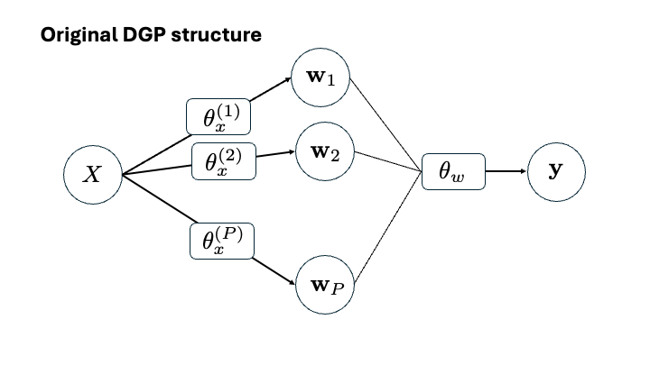

```{r setup, include=FALSE}
knitr::opts_chunk$set(echo = TRUE, fig.align = "center")
```

```{r}
library(deepgp)
library(mvtnorm)
```

# Previous works on variable selection for GPs

Most works on variable selection with GPs use a linear mean and a separable covariance with the lengthscale in the numerator.  

$$
\mathbf{y} \sim \mathcal{N}\left(X\beta, \Sigma_x\right)
\quad\textrm{where}\quad
\begin{array}{rl}
(X\beta)^{(i)} &= \sum_{d=1}^D x_{id}\beta_d \\
\Sigma_x^{(ij)} &= \tau^2\left[\mathrm{exp}\left(-\sum_{d=1}^D \theta_d(x_{id} - x_{jd})^2\right) + g\mathbb{I}_{i=j}\right]
\end{array}
$$

There is a closed-form MLE available for $\hat{\beta}$ and $\hat{\tau}^2$:

$$
\hat{\beta} = (X^\top \Sigma_x^{-1}X)^{-1} X^\top\Sigma_x^{-1} \mathbf{y}
$$

$$
\hat{\tau}^2 = \frac{1}{n}(\mathbf{y} - X\hat{\beta})^\top \Sigma_x^{-1}(\mathbf{y} - X\hat{\beta})
$$

The lengthscales $\boldsymbol\theta = [\theta_1, ..., \theta_d]$ requires numerical optimization.

In this framework, there are two avenues for "de-selecting" an input.

1. A particular $x_d$ could be taken out of the mean term $X\beta$.  This is equivalent to $\beta_d = 0$.
2. A particular $x_d$ could be taken out of the covariance term $\Sigma_n$.  This is equivalent to $\theta_d = 0$.

**Important Citations:**

* @linkletter2006variable: Places a mixture model prior on the lengthscale parameters with a point mass on zero.  Call the method "reference distribution variable selection."
* @joseph2008blind: Perform variable selection only in the $X\beta$ mean term.  Call this "blind kriging."
* @zhang2023indicator: Uses indicator functions to turn variables on/off.  If the indicator is zero, then the $\beta_i$ parameter in the $X\beta$ mean AND the $\theta_i$ parameter in the separable covariance are zero.  Note, to set $\theta$ equal to zero, we must put it in the numerator of the kernel.

# Traditional Monowarped DGPs

In our typical DGP framework, we have

$$
\begin{array}{rl}
\mathbf{y}&\sim\mathrm{GP}\left(0,\; \tau^2 (K_{\theta_w}(W) + g\mathbb{I})\right) \\
\mathbf{w}_p &\sim\mathrm{GP}\left(0,\; K_{\theta_x^p}(X) \right) \\
&\quad p=1,\dots,P
\end{array}
\quad\textrm{where}\quad
\begin{array}{rl}
K_{\theta_w}(W)^{(ij)} &= \mathrm{exp}\left(-\frac{1}{\theta_w} \sum_{p=1}^P(w_{ip} - w_{jp})^2\right) \\
K_{\theta_x^p}(X)^{(ij)} &= \mathrm{exp}\left(-\frac{1}{\theta_x^p} \sum_{d=1}^D(x_{id} - x_{jd})^2\right)
\end{array}
$$




In this original formulation, all dimensions of $X$ go to all dimensions of $W$.  There is no clear way to "de-select" a dimension of $X$.  If we wanted to draw inspiration from @linkletter2006variable, we could turn  $\theta_x^p$ into separable lengthscales, and then turn some of them off (going to $\infty$ in the denominator is equivalent to 0 in the numerator).  I think this is a terrible idea in our setting, because we would have $D\times P$ many unique lengthscale parameters to estimate here.  Very messy for very little gain.  [Or perhaps we give each dimension of $X$ a unique lengthscale, but keep these the same for all nodes of $W$?.  This just seems counterintuitive to me.]

Instead, I propose we embrace one-dimensional warpings.  Originally, we proposed the following monowarp DGP structure:

$$
\begin{array}{rl}
\mathbf{y}&\sim\mathrm{GP}\left(0,\; \tau^2 (K_{\theta_w^d}(W) + g\mathbb{I})\right) \\
\mathbf{w}_d &\sim\mathrm{monoGP}\left(0,\; K_{\theta_x^d}(\mathbf{x}_d) \right) \quad d=1,\dots,D
\end{array}
$$
where kernels $K(\cdot)$ are defined as above, and each $\mathbf{w}_d$ is forced to be monotonic.  


I have since developed a work-around to avoid separable lengthscales on the outer layer (by removing forced scaling of each warping).  We can then have the simpler model:

$$
\begin{array}{rl}
\mathbf{y}&\sim\mathrm{GP}\left(0,\; \tau^2 (K_{\theta_w}(W) + g\mathbb{I})\right) \\
\mathbf{w}_d &\sim\mathrm{monoGP}\left(0,\; K_{\theta_x^d}(\mathbf{x}_d) \right) \quad d=1,\dots,D
\end{array}
$$


# Swapping $\tau^2$ and $\theta$ - what happens to the prior?

Notice, in the latent layer of the monowarp DGP, we have essentially fixed $\tau^2 = 1$ and allowed estimation of $\theta$.  Now we propose a SWAP.  Fix $\theta_x^d = 1$ for all $d=1,\dots,D$, but incorporate a $\tau^2_d$ parameter that may be estimated.  Our model is then:

$$
\begin{array}{rl}
\mathbf{y}&\sim\mathrm{GP}\left(0,\; \tau_w^2 (K_{\theta_w}(W) + g\mathbb{I})\right) \\
\mathbf{w}_d &\sim\mathrm{monoGP}\left(0,\; \tau_{x_d}^2 K(\mathbf{x}_d) \right) \quad d=1,\dots,D
\end{array}
$$

Why is this so neat?  First, I have read [@zhang2004inconsistent] that in a one-dimensional (or isotropic) setting, only the ratio $\frac{\tau^2}{\theta}$ is identifiable.  The likelihood surface for these two variables is not conducive to optimizing.

### Let's investigate

To see this in action, let's create some random one-dimensional GP data and visualize the likelihood as a function of $\tau^2$ and $\theta$.

```{r, fig.width = 5, fig.height = 4}
x <- seq(0, 1, length = 10)
dx <- sq_dist(x)
y <- drop(rmvnorm(1, sigma = 1*exp(-dx/0.1)))
y <- (y - mean(y))/sd(y) # scale to zero mean unit variance

plot(x, y, main = "Toy data")
```

```{r, fig.width = 5, fig.height = 4}
theta <- round(exp(seq(log(0.01), log(1), length = 50)), 3)
tau2 <- round(seq(0.01, 10, length = 50), 3)
logl <- matrix(nrow = length(theta), ncol = length(tau2))
for (i in 1:length(theta))
  for (j in 1:length(tau2))
    logl[i, j] <- deepgp:::logl(y, dx, tau2 = tau2[j], theta = theta[i], 
                                g = 1e-6, v = 2.5)$ll

image(theta, tau2, logl, col = heat.colors(128), main = "logl")
contour(theta, tau2, logl, add = TRUE)
```

Certainly this surface is not conducive to numerical optimization.  Point made.

But, if we fix a value of $\tau^2$, we can perform effective MLE on $\theta$.

```{r, fig.width = 10}
theta <- round(exp(seq(log(0.01), log(1), length = 50)), 3)
tau2 <- c(0.1, 1, 10)
logl <- matrix(nrow = length(theta), ncol = length(tau2))
for (i in 1:length(theta))
  for (j in 1:length(tau2))
      logl[i, j] <- deepgp:::logl(y, dx, tau2 = tau2[j], theta = theta[i], 
                                g = 1e-6, v = 2.5)$ll

par(mfrow = c(1, 3))
for (j in 1:length(tau2)) {
  plot(theta, logl[, j], type = "l", main = paste0("tau2 = ", tau2[j]))
  points(theta[which.max(logl[, j])], max(logl[, j]), pch = 17, col = 4, cex = 2)
}

theta_for_tau2_1 <- theta[which.max(logl[, 2])] # save for later
```

We get different vales for the MLE of $\theta$, but these problems are all identifiable.

Can we do the same thing swapped?  Fix $\theta$ and estimate $\tau^2$?

```{r, fig.width = 10}
theta <- c(0.01, 0.1, 1)
tau2 <- round(seq(0.1, 10, length = 50), 3)
logl <- matrix(nrow = length(theta), ncol = length(tau2))
for (i in 1:length(theta))
  for (j in 1:length(tau2))
      logl[i, j] <- deepgp:::logl(y, dx, tau2 = tau2[j], theta = theta[i], 
                                g = 1e-6, v = 2.5)$ll

par(mfrow = c(1, 3))
for (i in 1:length(theta)) {
  plot(tau2, logl[i, ], type = "l", main = paste0("theta = ", theta[i]))
  points(tau2[which.max(logl[i, ])], max(logl[i, ]), pch = 17, col = 4, cex = 2)
}

tau2_for_theta_0.01 <- tau2[which.max(logl[, 1])] # save for later
```

So MLE is better behaved when we only estimate one of these parameters.  But how would this affect our statistical inferences?  Let's compare predictive surfaces.

```{r, fig.width = 10}
x_new <- seq(0, 1, length = 100)
dx_new <- sq_dist(x_new)
dx_cross <- sq_dist(x_new, x)

# First for tau2 = 1
p1 <- deepgp:::krig(y, dx, dx_new = dx_new, dx_cross = dx_cross, tau2 = 1, 
                   theta = theta_for_tau2_1, g = 1e-6, v = 2.5, mean = TRUE, s2 = TRUE)

# Second, fix theta = 0.1
p2 <- deepgp:::krig(y, dx, dx_new = dx_new, dx_cross = dx_cross, tau2 = tau2_for_theta_0.01, 
                   theta = 0.1, g = 1e-6, v = 2.5, mean = TRUE, s2 = TRUE)

par(mfrow = c(1, 2))
plot(x_new, p1$mean, type = "l", main = paste0("tau2 = 1, theta = ", theta_for_tau2_1))
lines(x_new, p1$mean - 2*sqrt(p1$s2), lty = 2)
lines(x_new, p1$mean + 2*sqrt(p1$s2), lty = 2)
points(x, y, col = 2)
plot(x_new, p2$mean, type = "l", main = paste0("tau2 = ", tau2_for_theta_0.01, ", theta = 0.1"))
lines(x_new, p2$mean - 2*sqrt(p2$s2), lty = 2)
lines(x_new, p2$mean + 2*sqrt(p2$s2), lty = 2)
points(x, y, pch = 20, col = 2)
```

Posterior mean is essentially the same, but the larger $\tau^2$ value results in wider UQ intervals.  Things could go really poorly if $\theta$ is fixed too large or $\tau^2$ is fixed too small.  Typically, we pre-scale $y$ to unit variance anytime we fix $\tau^2=1$, so there is some justification for this choice.  Can we develop a rule for how to select a good value of $\theta$?  We will need to revisit this...

### How do these values affect a monowarping?

We want to be confident that fixing $\theta$ and estimating $\tau^2$ will give us the same flexibility in our monotonic warpings.  We need to be cautious of fixing $\theta$ too large.

Let's investigate what our monowarp GP prior looks like for both of these situations - we want to make sure we have the same prior flexibility under the two different parameterizations.

Let's vary $\tau^2$ and $\theta$ and see how they affect the draws from the monoGP prior.

```{r}
x <- matrix(seq(0, 1, length = 100), ncol = 1)
x_grid <- matrix(seq(0, 1, length = 50), ncol = 1)
dx_grid <- sq_dist(x_grid)
grid_index <- deepgp:::fo_approx_init(x_grid, x)
```

```{r, fig.width = 10, fig.height = 3}
r <- 15
for (tau2 in c(0.01, 0.1, 1, 10)) {
  par(mfrow = c(1, 4), mar = c(4, 4, 4, 1))
  for (theta in c(0.01, 0.1, 1, 10)) {
    w_grid <- t(rmvnorm(r, sigma = tau2*exp(-dx_grid/theta)))
    w <- matrix(nrow = nrow(x), ncol = r)
    for (i in 1:r) {
      w[, i] <- deepgp:::monowarp_ref(x, x_grid, w_grid[, i], grid_index)
      w[, i] <- (w[, i] - mean(w[, i]))
    }
    matplot(x, w, type = "l", main = paste0("tau2 = ", tau2, "\n theta = ", theta,
                                            "\n ratio = ", tau2/theta))
  }
}
```

\newpage

What do we see?

* For larger ratios, the monotonic warpings are more wiggly.  As the ratio gets smaller, they are forced into linear mappings.
* For larger ratios, the span of w values (y-axis) is wider.  This will matter if we use an isotropic outer layer.
* As $\tau^2$ increases, warpings are allowed to become more nonlinear.  The same trend happens for $\theta$, but at a slower rate.
* If we fix $\theta$ at a reasonable value (like 0.1), then changing $\tau^2$ does give us flexibility to get a wide range of warpings (see second column of plots).  Yay!

# Swapping $\tau^2$ and $\theta$ - what happens to the posterior?

Presume we observe $\{X, \mathbf{y}\}$ where $X$ is $n\times D$.  Recall our swapped monowarped DGP model: 

$$
\begin{array}{rl}
\mathbf{y}&\sim\mathrm{GP}\left(0,\; \tau_w^2 (K_{\theta_w}(W) + g\mathbb{I})\right) \\
\mathbf{w}_d &\sim\mathrm{monoGP}\left(0,\; \tau_{x_d}^2 K(\mathbf{x}_d) \right) \quad d=1,\dots,D
\end{array}
$$

The unknown quantities that we need to infer are:

* $\tau^2_w$ (outer layer) - conditioned on $W$, integrate this out under a reference prior
* $\theta_w$ (outer layer) - use Metropolis Hastings sampling
* $g$ (outer layer, only if noisy) - keep $g$ fixed at a small value for now
* $\mathbf{w}_d$ for $d=1,\dots,D$ (inner layer) - use elliptical slice sampling
* $\tau^2_{x_d}$ for $d=1,\dots, D$ (inner layer) - conditioned on $\mathbf{w}_d$, integrate each of these out under a reference prior

### Derivation of profile likelihood

Starting with the outer layer, now denote $K = K_{\theta_w}(W) + g\mathbb{I}$.  Then,

$$
\begin{aligned}
\mathcal{L}(\mathbf{y} \mid W, \tau^2) &\propto |\tau^2K|^{-\frac{1}{2}} * \mathrm{exp}\left(-\frac{1}{2} \mathbf{y}^\top (\tau^2K)^{-1} \mathbf{y}\right) \\
  &\propto (\tau^2)^{-\frac{n}{2}} |K|^{-\frac{1}{2}} * \mathrm{exp}\left(-\frac{1}{2\tau^2}\mathbf{y}^\top K^{-1} \mathbf{y}\right)
\end{aligned}
$$

Using a reference prior $\pi(\tau^2) \propto \frac{1}{\tau^2}$, we have the posterior:

$$
\begin{aligned}
\mathcal{L}(\mathbf{y}, \tau^2 \mid W) &\propto \mathcal{L}(\mathbf{y} \mid W, \tau^2)\pi(\tau^2) \\
&\propto (\tau^2)^{-\frac{n}{2}} |K|^{-\frac{1}{2}} * \mathrm{exp}\left(-\frac{1}{2\tau^2}\mathbf{y}^\top K^{-1} \mathbf{y}\right) * (\tau^2)^{-1} \\
&\propto (\tau^2)^{-\frac{n}{2} - 1} |K|^{-\frac{1}{2}} * \mathrm{exp}\left(-\frac{1}{2\tau^2}\mathbf{y}^\top K^{-1} \mathbf{y}\right)
\end{aligned}
$$

We can INTEGRATE $\tau^2$ out of this!

$$
\begin{aligned}
\mathcal{L}(\mathbf{y} \mid W) &\propto \int_0^\infty \mathcal{L}(\mathbf{y}, \tau^2 \mid W) \; d\tau^2 \\
&\propto |K|^{-\frac{1}{2}} \int_0^\infty (\tau^2)^{-\frac{n}{2} - 1}  * \mathrm{exp}\left(-\frac{1}{\tau^2} \left(\frac{1}{2}\mathbf{y}^\top K^{-1} \mathbf{y}\right)\right) \; d\tau^2 \\
\end{aligned}
$$
Here, we recognize the kernel of an inverse Gamma distribution with $\alpha = \frac{n}{2}$ and $\beta = \frac{1}{2}\mathbf{y}^\top K^{-1} \mathbf{y}$.  Thus, dropping constants, we have:

$$
\begin{aligned}
\mathcal{L}(\mathbf{y} \mid W) &\propto |K|^{-\frac{1}{2}} \Gamma(\alpha) \beta^{-\alpha} \\
  &\propto |K|^{-\frac{1}{2}} \left(\mathbf{y}^\top K^{-1} \mathbf{y}\right) ^{-\frac{n}{2}} \\
\log\mathcal{L}(\mathbf{y}\mid W) &\propto -\frac{1}{2}\log|K| - \frac{n}{2}\log\left(\mathbf{y}^\top K^{-1} \mathbf{y}\right)
\end{aligned}
$$

We may use this simplified profile likelihood to conduct inference in our outer layer ($W$ and $\theta_y$).  But!  Note we did not just fix $\tau^2$ to one.  So when we conduct inference this way, we need to be careful of how we treat $\tau^2$ in our predictions.  For an ESS samaple of $W$, and a mapping of predictive locations $\mathcal{X}$ to warped locations $\mathcal{W}$, we have:

$$
\mathbf{y}^\star \mid \mathbf{y}, W \sim \mathrm{GP}(\mu^\star, \Sigma^\star)
\quad\textrm{where}\quad
\begin{aligned}
\mu^\star &= K(\mathcal{W}, W) \left(K(W) + g\mathbb{I}\right)^{-1} \mathbf{y} \\
\Sigma^\star &= \tau^2\left[K(\mathcal{W}) - K(\mathcal{W}, W)\left(K(W) + g\mathbb{I}\right)^{-1} K(W, \mathcal{W})\right]
\end{aligned}
$$

What do we do with the $\tau^2$ here?  We can use a neat trick.  Remember the profile likelihood we derived above?  It is equal to the original likelihood when we plug in the MLE estimate $\hat{\tau}^2 = \frac{1}{n}\mathbf{y}^\top K^{-1} \mathbf{y}$.  Specifically,

$$
\begin{aligned}
\log\mathcal{L}(\mathbf{y} \mid W, \tau^2 = \hat{\tau}^2) &\propto -\frac{n}{2}\log(\hat{\tau}^2) - \frac{1}{2}\log|K| \\
  &\propto -\frac{n}{2}\log(\mathbf{y}^\top K^{-1}\mathbf{y}) - \frac{1}{2}\log|K|
\end{aligned}
$$

We have a match!  What does this tell us?  If we conduct our MCMC sampling with the profile likelihood (integrating $\tau^2$ out), all we need to do to match this setting when we do posterior predictions is use the plug-in estimator $\hat{\tau}^2$.  Cha-ching!

### How does this work on the inner layer?

All the derivations we just did involved only a single GP - $\mathbf{y}$ given $W$.  So we can apply the exact same things to our inner GP - $\mathbf{w}_d$ given $\mathbf{x}_d$.  Now let $K = K(\mathbf{x}_d)$ (noise free).  Skipping over the details, our profile likelihood is:

$$
\log\mathcal{L}(\mathbf{w}_d \mid \mathbf{x}_d) \propto -\frac{1}{2}\log|K| - \frac{n}{2}\log\left(\mathbf{w}_d^\top K^{-1}\mathbf{w}_d\right)
$$

For predictions, when we map predictive locations $\mathcal{X}$ to warped locations $\mathcal{W}$, we need to use the MLE estimator $\hat{\tau}^2 = \frac{1}{n}\mathbf{w}_d K^{-1} \mathbf{w}_d$ (unless we do a mean-only mapping, in which case $\hat{\tau}^2$ is irrelevant).

### Ok, let's test this out

```{r}
library(deepgp)
library(mvtnorm)

n <- 10
d <- 1
x <- as.matrix(seq(0, 1, length = n))
y <- drop(rmvnorm(1, sigma = 1*exp(-sq_dist(x)/0.1)))
nmcmc <- 1000
D <- 1
monowarp <- TRUE
pmx <- FALSE
verb <- TRUE
true_g <- 1e-6
v <- 2.5
settings <- NULL
cov <- "matern"
vecchia <- FALSE

x_grid <- deepgp:::check_monowarp(monowarp, x, d, D) # returns NULL if monowarp = FALSE
if (!is.null(x_grid)) monowarp <- TRUE

settings <- deepgp:::check_settings(settings, layers = 2, monowarp, is.null(true_g))
settings <- deepgp:::check_pmx(settings, pmx, d, D) # appends pmx and inner_tau2 to settings list
settings$inner_theta <- 0.1
initial <- list(w = NULL, tau2 = 1, theta_y = 0.1, theta_w = 0.1, g = 0.001,
                inner_tau2 = 1)
initial <- deepgp:::check_initialization(initial, layers = 2, monowarp = monowarp, 
                                         x = x, x_grid = x_grid, D = D, 
                                         vecchia = vecchia, v = v, m = m, 
                                         pmx = settings$pmx, 
                                         inner_tau2 = settings$inner_tau2)
samples_orig <- deepgp:::gibbs_two_layer_mono(x, y, x_grid, nmcmc, D, verb,
                                              initial, true_g, settings, v)
samples_swap <- deepgp:::gibbs_two_layer_mono_swap(x, y, x_grid, nmcmc, D, verb, 
                                                   initial, true_g, settings, v)
```

How do the warpings between the original and the swapped version look?

```{r}
par(mfrow = c(1, 2))
matplot(x_grid, t(samples_orig$w_grid[501:1000, , 1]), type = "l")
matplot(x_grid, t(samples_swap$w_grid[501:1000, , 1]), type = "l")
```

-------
# References